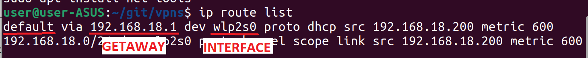

# Linux

1) Download [tun2socks](https://github.com/xjasonlyu/tun2socks/releases/tag/v2.4.1) for your OS and platform
2) Find out your Getaway (GETAWAY) and default interface (INTERFACE).
```bash
ip route list
```


3) Run 
```bash
sudo ip tuntap add mode tun dev tun0
sudo ip addr add 198.18.0.1/15 dev tun0
sudo ip link set dev tun0 up
```
```bash
sudo ip route del default
sudo ip route add default via 198.18.0.1 dev tun0 metric 1
sudo ip route add default via <GETAWAY> dev <INTERFACE> metric 10
```
4) Run
```bash
sudo ./tun2socks -device tun0 -proxy socks5://<NAME>:<PASSWORD>@<SERVER>:<PORT> -interface <INTERFACE>
```

>Note: sometimes we need to disable rp_filter for the corresponding interface so that it can receive packets from other interfaces.
```bash
sysctl net.ipv4.conf.all.rp_filter=0
sysctl net.ipv4.conf.eth0.rp_filter=0
```

## How to shutdown
Terminate the command from step four with ctrl+c
```bash
sudo ip route del default
```

or restart your system =)

>todo find a way to restart the network service
