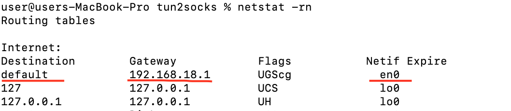

# MacOs

1) Download [tun2socks](https://github.com/xjasonlyu/tun2socks/releases/tag/v2.4.1) for your OS and platform
2) Find out your Getaway (GETAWAY) and default interface (INTERFACE).
```bash
netstat -rn
```


3) Run in separate Terminal
```bash
sudo ./tun2socks -device utun123 -proxy socks5://<USERNAME>:<PASSWORD>@<SERVER>:<PORT> -interface <INTERFACE>
```
4) Run
```bash
sudo ifconfig utun123 <GETAWAY> 198.18.0.1 up
```
```bash
sudo route add -net 1.0.0.0/8 198.18.0.1
sudo route add -net 2.0.0.0/7 198.18.0.1
sudo route add -net 4.0.0.0/6 198.18.0.1
sudo route add -net 8.0.0.0/5 198.18.0.1
sudo route add -net 16.0.0.0/4 198.18.0.1
sudo route add -net 32.0.0.0/3 198.18.0.1
sudo route add -net 64.0.0.0/2 198.18.0.1
sudo route add -net 128.0.0.0/1 198.18.0.1
sudo route add -net 198.18.0.0/15 198.18.0.1
```
## How to shutdown
Terminate the command from step three with ctrl+c
