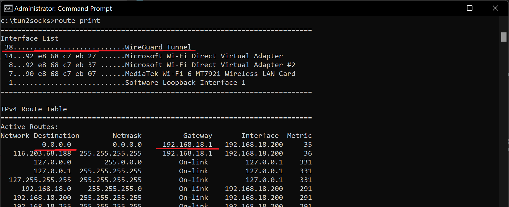

# Windows
1) Download [tun2socks](https://github.com/xjasonlyu/tun2socks/releases/tag/v2.4.1) for your OS and platform
2) To use it in windows, download [wintun](https://www.wintun.net/) to the tun2socks folder or the system PATH.
3) Run Terminal as Administrator
4) Run
```bash
start tun2socks -device wintun -proxy socks5://<NAME>:<PASSWORD>@<SERVER_IP>:<PORT>
netsh interface ip set address name="wintun" source=static addr=192.168.123.1 mask=255.255.255.0 gateway=none
```
5) Find out your Getaway (GETAWAY) and default interface (INTERFACE).

```bash
route print
```

>in that example INTERFACE = 38

6) Run
```bash
route add 0.0.0.0 mask 0.0.0.0 192.168.123.1 if <INTERFACE> metric 5
route add <SERVER_IP> mask 255.255.255.255 <GETAWAY>
```

## How to shutdown
```bash
taskkill /IM tun2socks.exe
```